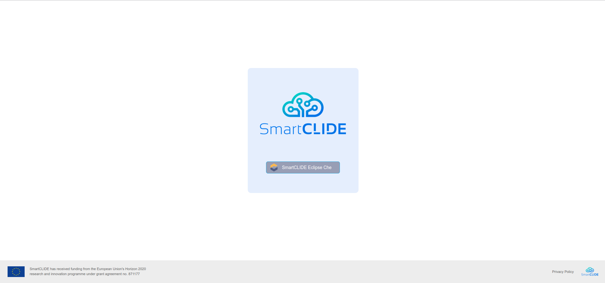
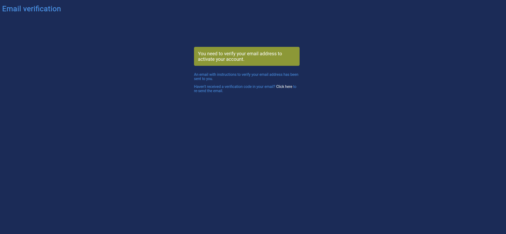
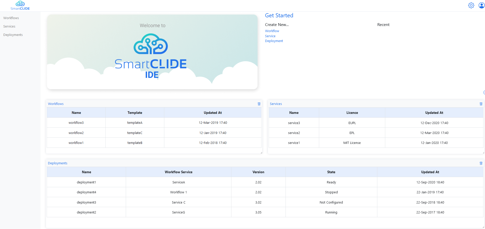
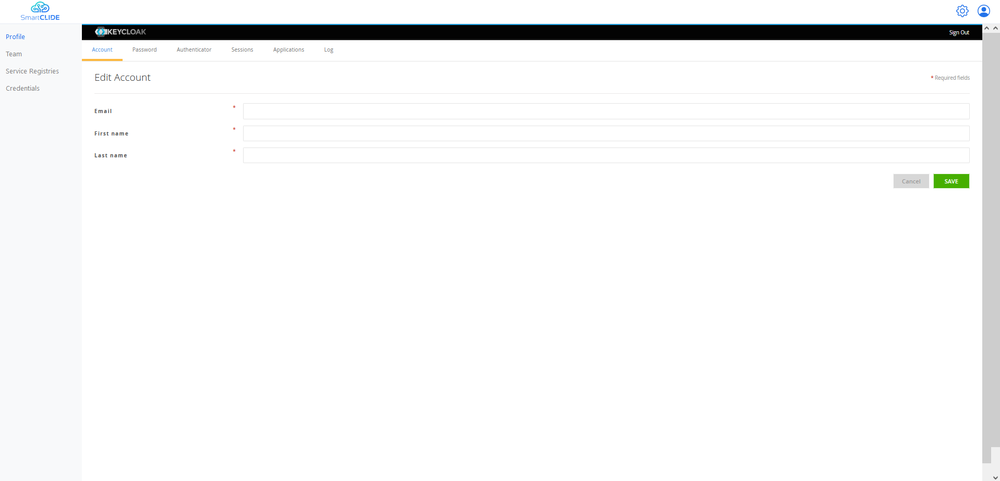
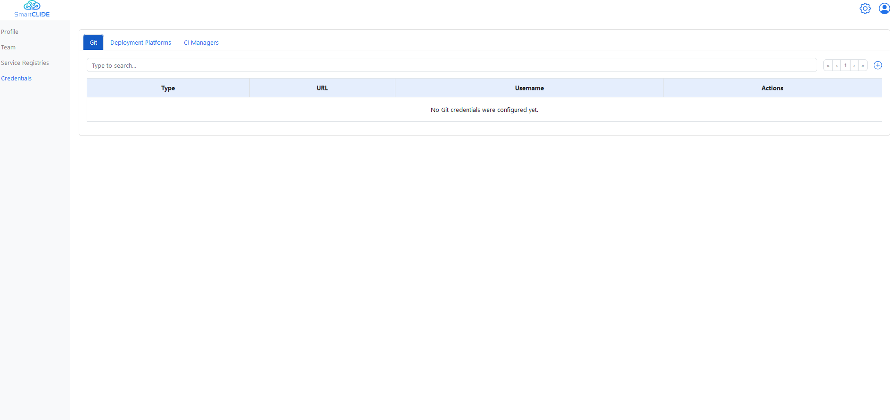
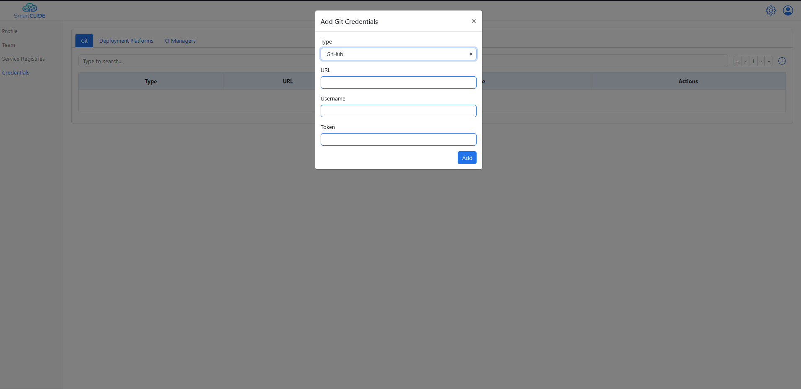

# For the developer

This page contains some very-easy-to-follow guides for developers to start building services using the SmartCLIDE IDE.

## Registration and login

	

		The first thing a developer needs to do in order to start using the SmartCLIDE IDE, is to navigate to the <a href="https://ide.che.smartclide.eu/">SmartCLIDE IDE landing page</a>:
	

	

		Then, by hitting the 'SmartCLIDE Eclipse Che' button, the user is redirected to the SmartCLIDE Login Page:	
	

	

		From there, the developer hits the "Register" button, and is redirected to the SmartCLIDE IDE Registration Page:
	

	

		After the developer has filled in his details, a verification link is sent through email to the email account that he provided, and the following page is presented to the user:
	

	

		The user clicks the verification link sent to him in order to verify his account. Then, he can navigate back to the SmartCLIDE Login Page, enter his credentials and log into the SmartCLIDE IDE. After that, the SmartCLIDE Main Page is presented to the user:
	

## Setting up profile

	

		After landing to the SmartCLIDE Main Page, the developer can edit his profile by clicking the little human icon in the upper right corner, and then clicking on the "My Account" option. By doing this, he is redirected to the SmartCLIDE Profile Editing Page:
	

	

		From the SmartCLIDE Profile Editing Page the user can edit his security credentials (SmartCLIDE uses <a href="https://www.keycloak.org/">Keycloak</a> for user authentication and authorization), like email, first name, last name and password. In addition, by clicking on the "Credentials" option the user is redirected to a new view where he can add credentials related to source control repositories (e.g., GitHub credentials), CI/CD managers (e.g., Jenkins) and Deployment Platforms.
	

	

		For example, if the user wants to connect his GitHub profile with the SmartCLIDE IDE, he can add his credentials by clicking the '+' icon in the upper right corner, and fill the requested fields in the form that opens (i.e., Type->GitHub, GitHub URL, username and GitHub Personal Access Token). 
	

## Building the first service