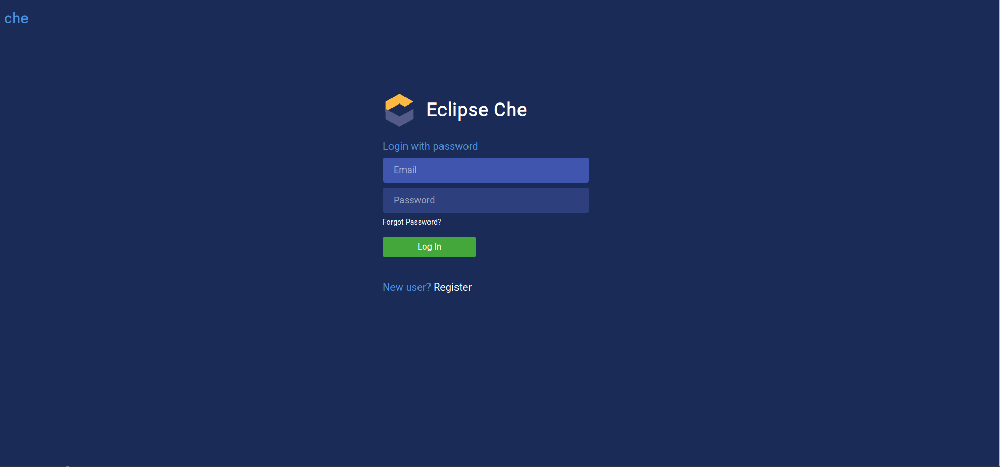
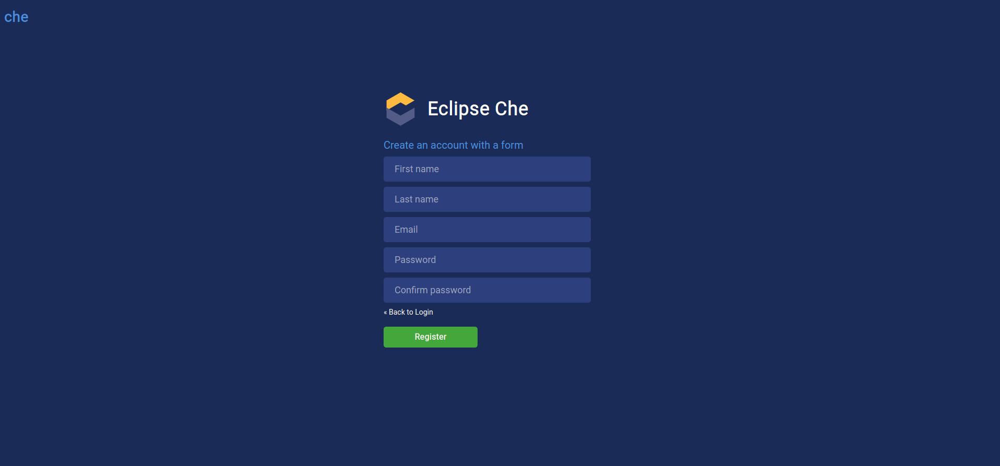

## For the developer

This page contains some very-easy-to-follow guides for developers to start building services using the SmartCLIDE IDE.

### Registration and login

The first thing a developer needs to do in order to start using the SmartCLIDE IDE, is to navigate to the [SmartCLIDE IDE landing page](https://ide.che.smartclide.eu/):

Then, by hitting the 'SmartCLIDE Eclipse Che' button, the user is redirected to the SmartCLIDE Login Page:

From there, the developer hits the "Register" button, and is redirected to the SmartCLIDE IDE Registration Page:

After the developer has filled in his details, a verification link is sent through email to the email account that he provided, and the following page is presented to the user:

The user clicks the verification link sent to him in order to verify his account. Then, he can navigate back to the SmartCLIDE Login Page, enter his credentials and log into the SmartCLIDE IDE.

### Setting up profile

### Building the first service